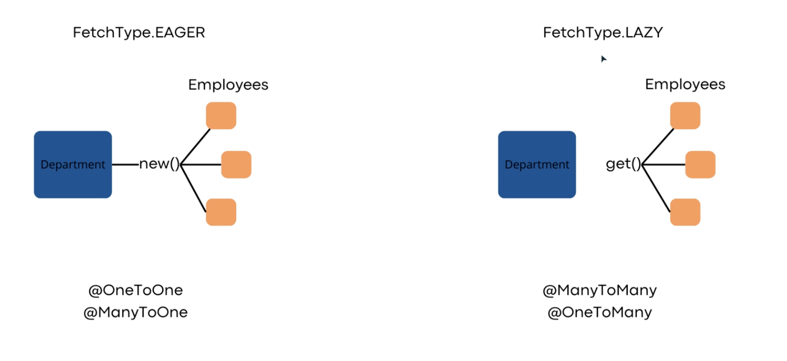
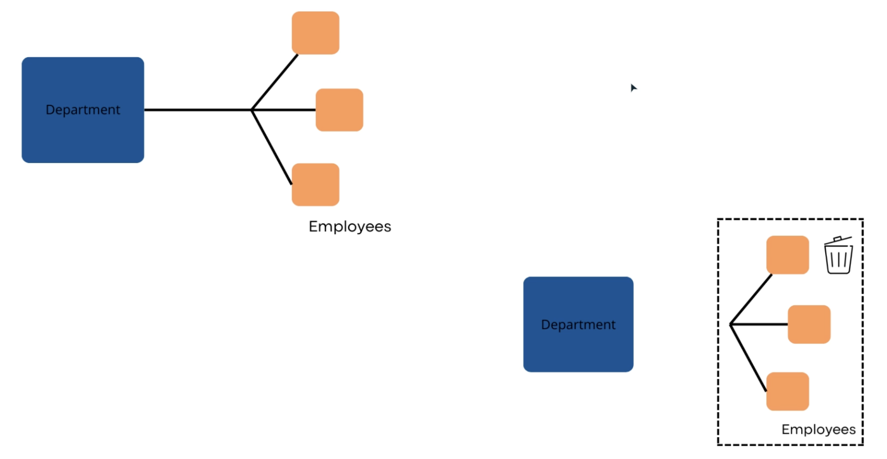

# JPA [proyecto y documentación]

## FetchType: Existen 2 tipos: Es el tipo de carga 

-   **FetchType.EAGER (carga ansiosa)**: Quiere decir que cuando se busque el Departamento, cargará al mismo tiempo  los empleados. La relación @OneToOne y @ManyToOne por defecto utilizan este tipo de FetchType.

-   **FetchType.LAZY (carga perezosa)**: Es lo contrario al EAGER, quiere decir que cuando se cargue la entidad Departamento no se cargarán sus empleados. Y para poder cargar sus empleados se tendrá que hacer una consulta que haga join con los empleados findByDepartamentAndEmployees, las anotaciones @ManyToMany y @OneToMany por defecto usan ese FetchType. 

## CascadeType: Forma en la que se propagan las entidades(entidades relacionadas entre si)

- **PERSIST:** Cuando se persiste la entidad principal también se persisten las relacionadas
- **MERGE:** Fusionar los cambios de la entidad principal también se fusionan los cambios en las entidades relacionadas
- **REMOVE:** Eliminando la entidad principal se eliminan las entidades relacionadas
- **REFRESH:** Se actualiza una vez que note una actualización
- **DETACH:** Se quita la relación de una entidad relacionada con la principal
- **ALL:** Engloba todas las anteriores

## Orphan Removal: Se quedan sin relación con la entidad principal

### Relaciones @OneToMany y @OneToOne

## Anotaciones de JPA :
- **@Entity:** Marca la clase como una entidad que tendrá su contraparte en una bd
- **@Table:** Se utiliza para especificar los detalles de una tabla y customizar el nombre de la tabla así como la generación de constraints y creación de índices
- **@Id:** Indica que el atributo de la clase es la llave primaria de la tabla.
- **@GeneratedValue:** Especifica la estrategia de la llave primaria
  - **IDENTITY :** Utiliza el autoincrementable de la BD
  - **SEQUENCE :** Utiliza la secuencia de la BD
  - **TABLE :** Utiliza otra tabla para obtener los valores
  - **UUID :** Utiliza un UUID como llave primaria
  - **AUTO :** JPA selecciona
- **@Column:** Se usa para detallar las características del atributo(columna en bd), como el mappeo, longitud, si puede ser nulo, etc