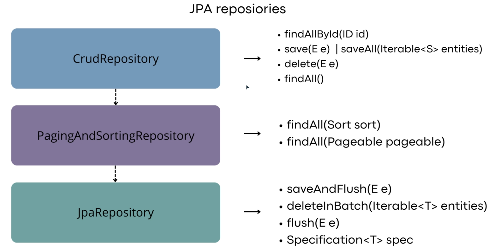

# JPA [proyecto y documentación]

## FetchType: Son los tipos de carga 

-   **FetchType.EAGER (carga ansiosa)**: Quiere decir que cuando se busque el Departamento, cargará al mismo tiempo  los empleados. La relación @OneToOne y @ManyToOne por defecto utilizan este tipo de FetchType.

-   **FetchType.LAZY (carga perezosa)**: Es lo contrario al EAGER, quiere decir que cuando se cargue la entidad Departamento no se cargarán sus empleados. Y para poder cargar sus empleados se tendrá que hacer una consulta que haga join con los empleados findByDepartamentAndEmployees, las anotaciones @ManyToMany y @OneToMany por defecto usan ese FetchType. 

## CascadeType: Forma en la que se propagan las entidades(entidades relacionadas entre si)

- **PERSIST:** Cuando se persiste la entidad principal también se persisten las relacionadas
- **MERGE:** Fusionar los cambios de la entidad principal también se fusionan los cambios en las entidades relacionadas
- **REMOVE:** Eliminando la entidad principal se eliminan las entidades relacionadas
- **REFRESH:** Se actualiza una vez que note una actualización
- **DETACH:** Se quita la relación de una entidad relacionada con la principal
- **ALL:** Engloba todas las anteriores

## Orphan Removal: Se quedan sin relación con la entidad principal

### Relaciones @OneToMany y @OneToOne

## JPA - Query Methods 
**Son las consultas que se realizan con las palabras clave, como las definidas en la documentación de spring**
  https://docs.spring.io/spring-data/jpa/reference/jpa/query-methods.html

## JPA - Índices
**@Table(name = "nombre_tabla", indexes = {@Index(name = "idx_product_name", columnList = "product_name")})**
- **name = "idx_product_name:** Indica el nombre del indice como está en la BD
- **columnList = "product_name":** Indica el campo(atributo) de la tabla  sobre el cual se aplicará el índice

## JPA Repositories: 

## JPA - Transacciones
- **@Transactional: Se declara un método o una clase para indicar que debe ser ejecutada dentro de un contexto transaccional, indicando que si existe un error en el proceso las operaciones pueden ser revertidad (Rollback) manteniendo la integridad de los datos**

- Propagaciones:
  - **@Transactional(propagation = Propagation.REQUIRED)** (defualt) : Evalua si hay una transacción activa, si la hay toma ese contexto y continua sino genera una nueva transacción.
  - **@Transactional(propagation = Propagation.SUPPORTS)** : Si hay una transacción activa toma eL contexto y continua sino todo lo que sigue lo ejecuta fuera de una transacción.
  - **@Transactional(propagation = Propagation.MANDATORY)** : Si hay una transacción activa toma eL contexto y continua sino lanza una exception, indicando que ese método debe ser ejecutado en un contexto transaccional.
  - **@Transactional(propagation = Propagation.REQUIRES_NEW)** : Creará una nueva transacción para el metodo que la invoca, suspendiento temporalmente la transacción actual si es que existe
  - **@Transactional(propagation = Propagation.NOT_SUPPORTED)** : El método se ejecutará simpre sin transacción, si existe una transacción en curso, será suspendida.
  - **@Transactional(propagation = Propagation.NEVER)** : El método debe ejecutarse sin una transacción. Si existe una transacción en curso, se lanzará una excepción.

## Anotaciones de JPA :
- **@Entity:** Marca la clase como una entidad que tendrá su contraparte en una bd
- **@Table:** Se utiliza para especificar los detalles de una tabla y customizar el nombre de la tabla así como la generación de constraints y creación de índices
- **@Id:** Indica que el atributo de la clase es la llave primaria de la tabla.
- **@GeneratedValue:** Especifica la estrategia de la llave primaria
  - **IDENTITY :** Utiliza el autoincrementable de la BD
  - **SEQUENCE :** Utiliza la secuencia de la BD
  - **TABLE :** Utiliza otra tabla para obtener los valores
  - **UUID :** Utiliza un UUID como llave primaria
  - **AUTO :** JPA selecciona
- **@Column:** Se usa para detallar las características del atributo(columna en bd), como el mappeo, longitud, si puede ser nulo, etc